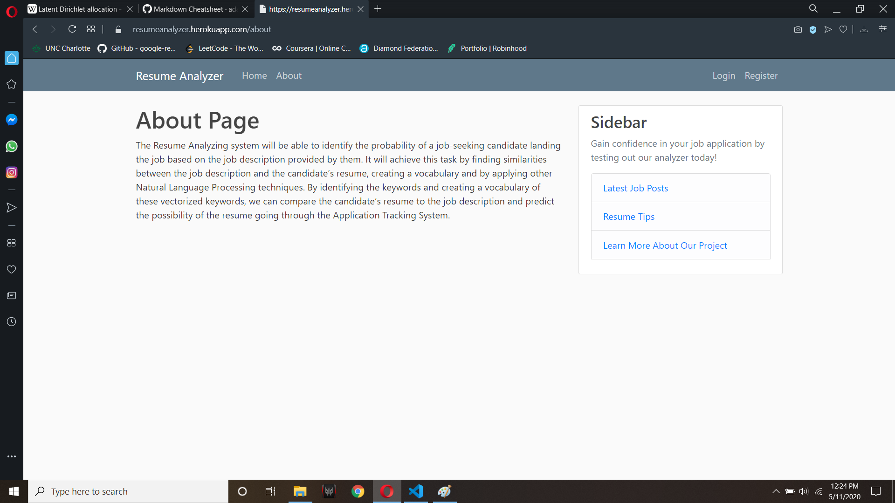
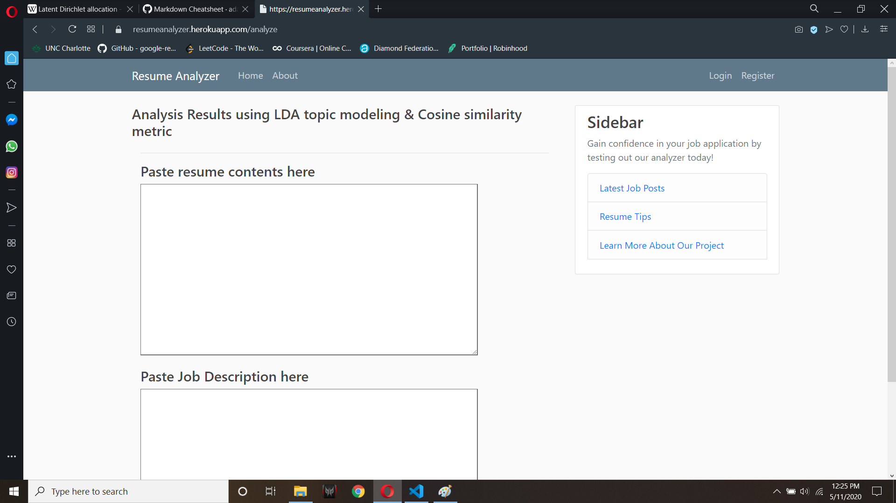
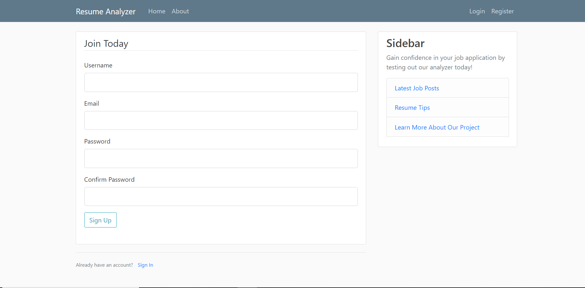

# Resume Analyzing System using LDA Topic Modeling

## Introduction
The system uses a pre-trained gensim LDA model on [Kaggle](https://www.kaggle.com/madhab/jobposts "this") dataset. It uses a Python/Flask backend to interact with it's web interface. The demo is available [Demo Link](resumeanalyzer.herokuapp.com "here").

## Overview

In natural language processing, the latent Dirichlet allocation (LDA) is a generative statistical model that allows sets of observations to be explained by unobserved groups that explain why some parts of the data are similar. For example, if observations are words collected into documents, it posits that each document is a mixture of a small number of topics and that each word's presence is attributable to one of the document's topics. LDA is an example of a topic model and belongs to the machine learning toolbox and in wider sense to the artificial intelligence toolbox.

We first identify the keywords in the title using our pre-trained model, first for the job description and then the resume textboxes. This is then simply compared with a cosine similarity metric to throw out a number and it's matching keyword to determine how it relates to our model data.

## User Interface

#### In conclusion, since this is a unsupervised approach to providing a solution to a much broader spectrum, the results are considerably underwhelming.
